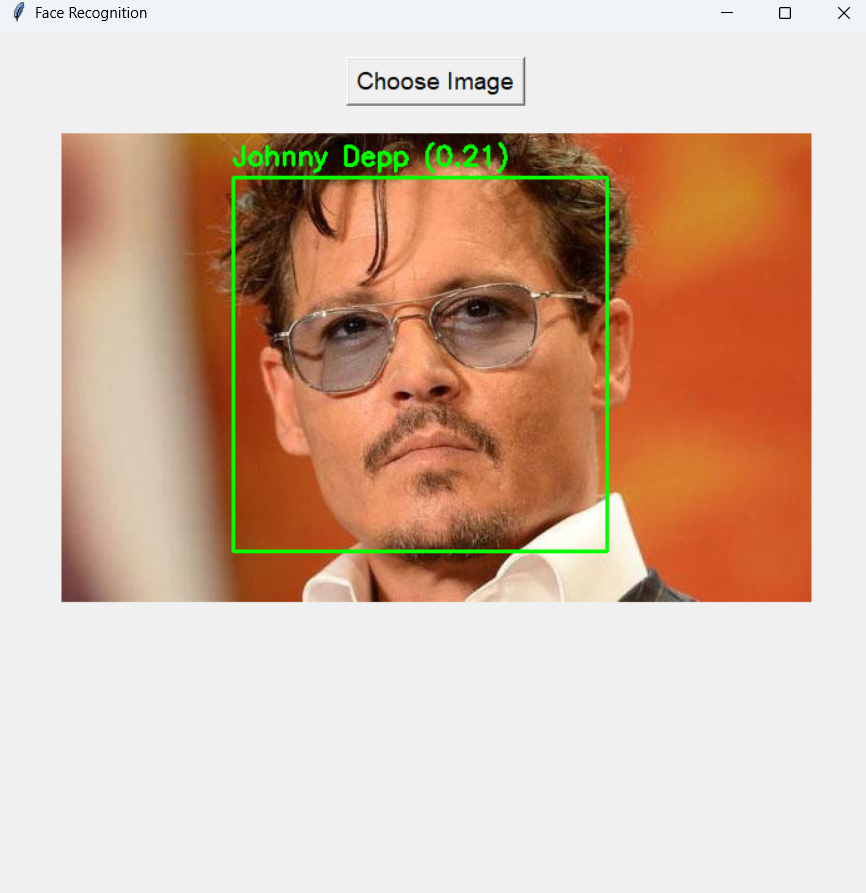

# Face Recognition Lab 8

This project is a simple face recognition application using PCA (Eigenfaces) and a Tkinter-based graphical interface. It allows you to select an image, detects faces, and recognizes them based on a pre-trained dataset.

## Features

- **Face Detection:** Uses Haar Cascade to detect faces in images.
- **Face Recognition:** Uses PCA (Eigenfaces) to extract features and recognize faces by cosine similarity.
- **GUI:** User-friendly interface built with Tkinter for easy image selection and result display.

## Demo

 The main interface of the application when launched.  
 The interface after selecting an image for testing.  
 The result after face detection and recognition.

## How It Works

1. **Training (data.py):**
   - The script scans the `images/` directory, detects faces in each image, resizes them to 100x100, and flattens them.
   - PCA is trained on all detected faces to extract eigenfaces.
   - The trained PCA model, projected face vectors, and labels are saved to `eigenface_data.pkl`.

2. **Recognition (main.py):**
   - The GUI allows you to select an image.
   - The selected image is processed: faces are detected, resized, and projected into PCA space.
   - Cosine similarity is computed between the input face and the database.
   - If the similarity is above a threshold, the name is displayed; otherwise, "Unknown" is shown.

## Installation

1. **Install dependencies:**
   ```
   pip install -r requirements.txt
   ```

2. **Prepare the dataset:**
   - Place your face images in the `images/` directory, organized in subfolders by person name.

3. **Train the model:**
   ```
   python data.py
   ```

4. **Run the application:**
   ```
   python main.py
   ```

## Notes

- The file `haarcascade_frontalface_default.xml` is required for face detection.
- The recognition threshold can be adjusted in `main.py` for stricter or looser matching.
- The application supports `.jpg`, `.jpeg`, and `.png` images. 
